# 1 下载

## 1.1 下载VS Code

打开浏览器，输入”https://code.visualstudio.com/“后回车。

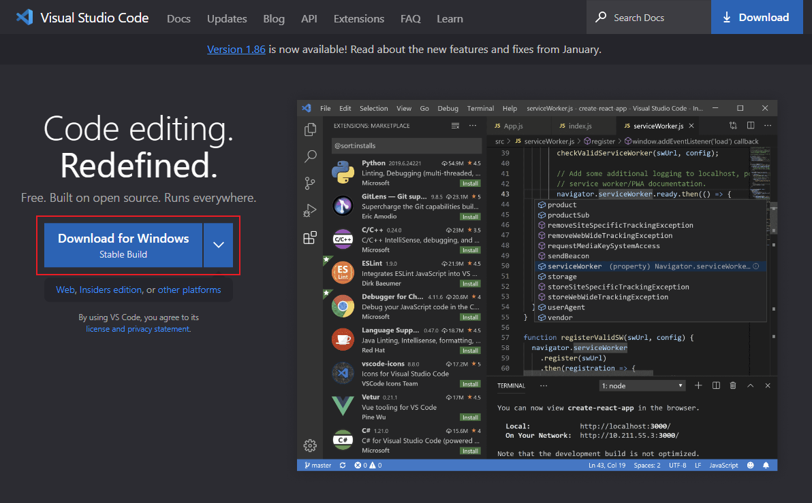

点击“Download for Windows”，下载获得文件“VSCodeUserSetup-x64-1.xx.x.exe”。

## 1.2 下载.NET SDK

打开浏览器，输入”https://dotnet.microsoft.com/zh-cn/“后回车。

点击下载按钮，进入下载页面。

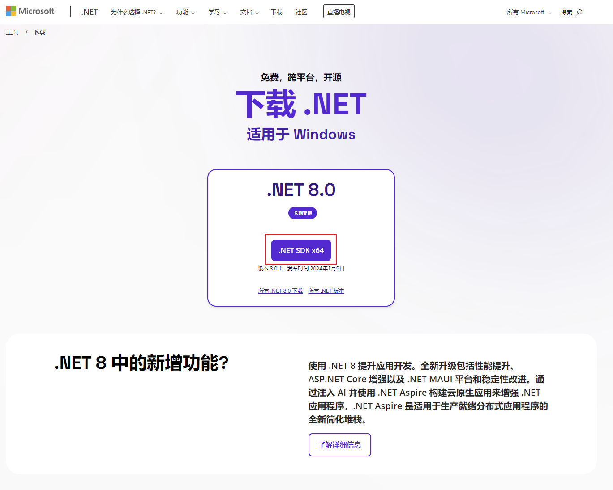

点击“.NET SDK x64”，下载获得文件“dotnet-sdk-8.0.xxx-win-x64.exe”

# 2 安装

## 2.1 安装VS Code

双击文件“VSCodeUserSetup-x64-1.xx.x.exe”进行安装。

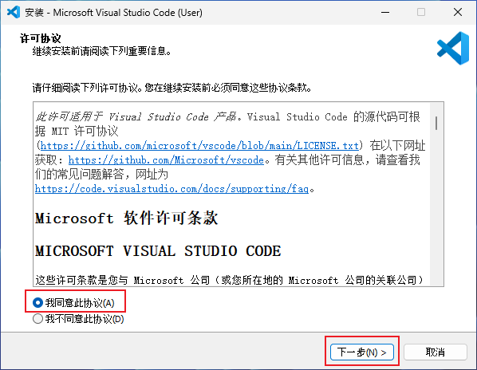

选择“我同意此协议”，并点击下一步。

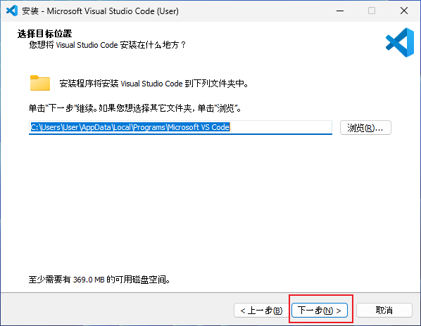

点击下一步。

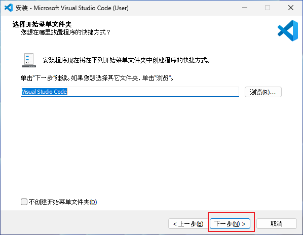

此处最好全部勾选，然后点击下一步。

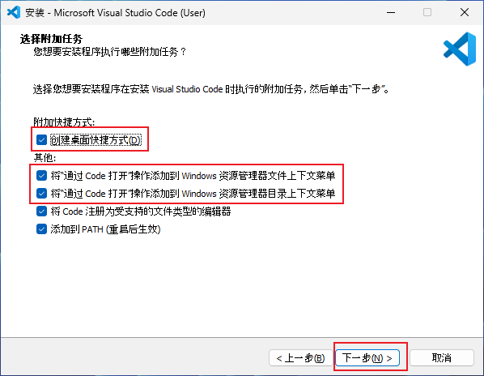

点击安装。

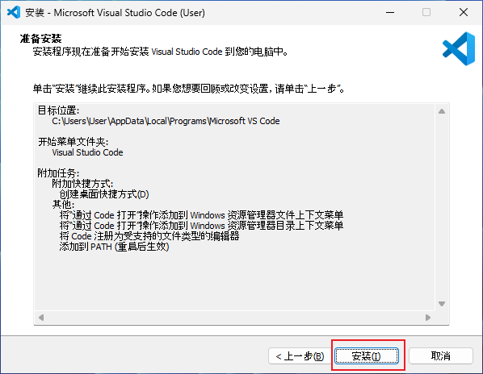

正在安装：

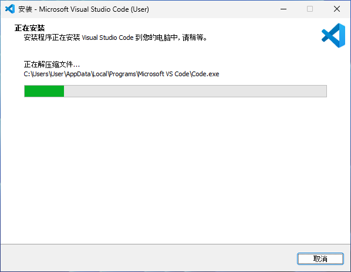

安装完成：

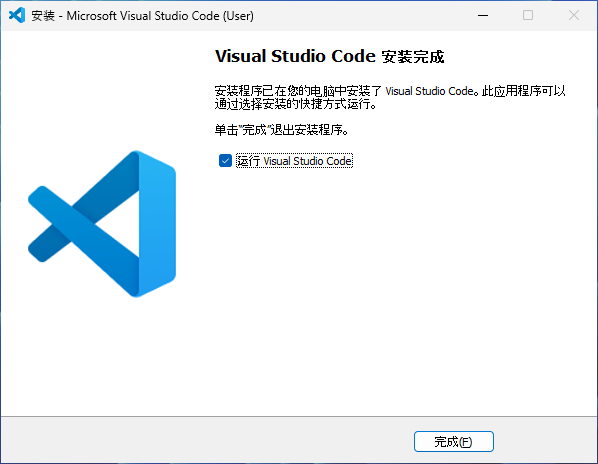

点击完成运行Visual Studio Code。

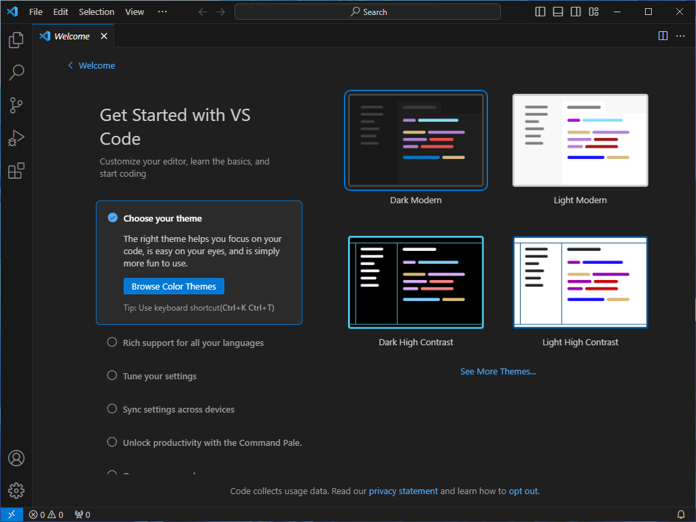

### 安装扩展：

（1）Chinese (Simplified) (简体中文) Language Pack for Visual Studio Code

（2）C#

（3）IntelliCode

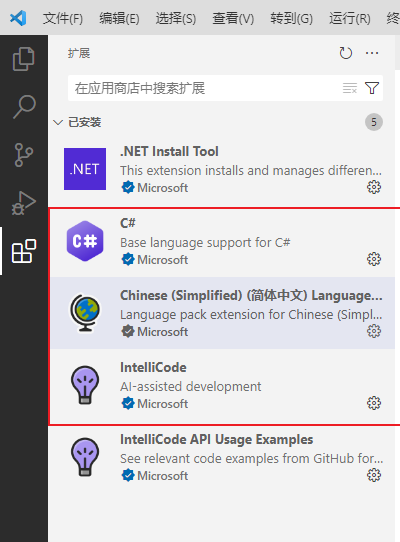

## 2.2 安装.NET SDK

双击文件“dotnet-sdk-8.0.xxx-win-x64.exe”进行安装。

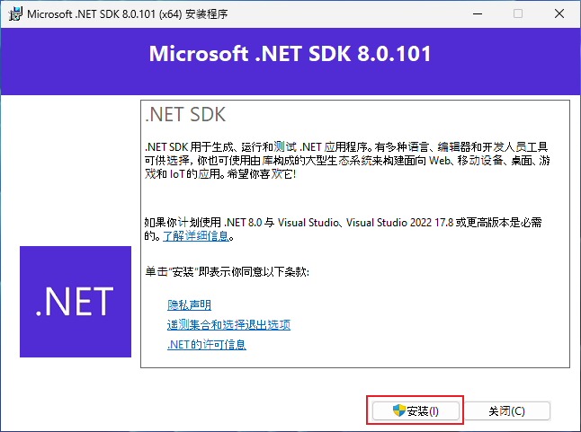

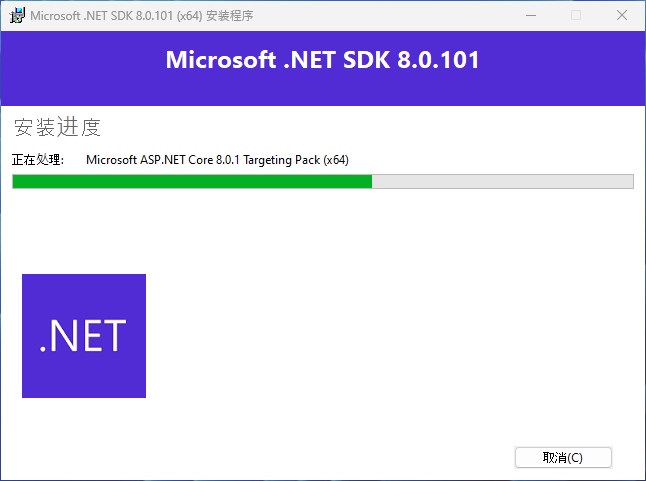

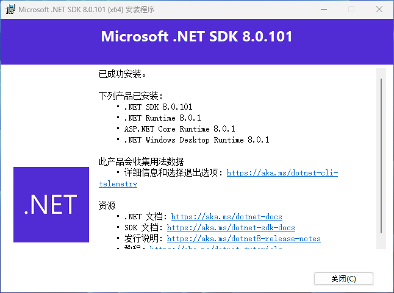

### 验证.NET SDK是否安装成功：

在终端（CMD或PowerShell）输入“dotnet --info”后回车，如果出现如下信息，则表示SDK安装成功。

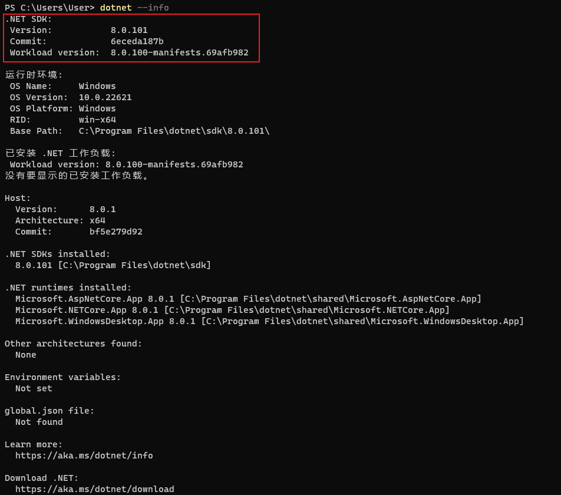

# 3 创建项目

在电脑桌面（或其他文件夹）右键呼出菜单，点击在终端中打开（或者按Win+R运行CMD，通过命令行进入某个文件夹）。

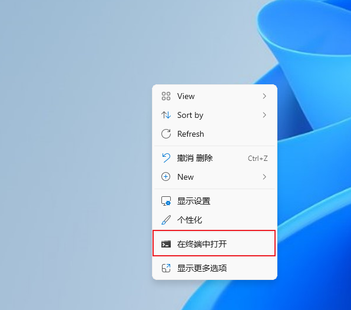

在终端中输入“dotnet new web --no-https --use-program-main -o FirstWeb”然后回车。

dotnet是.NET开发工具的命令。

new表示要创建一个项目。

web是"ASP.NET Core 空"项目模版。

--no-https表示不使用https模式。

--use-program-main表示不使用顶级语句。

-o FirstWeb表示创建的文件放在一个名为“FirstWeb”的文件夹中。

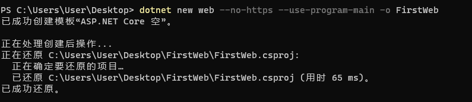

# 4 运行项目

输入“cd FirstWeb”回车进入FirstWeb文件夹。

输入“dotnet run”启动项目。

若出现以下字符，说明项目启动成功。

![image-20240208234058392](VS Code + .NET SDK.assets/image-20240208234058392.png

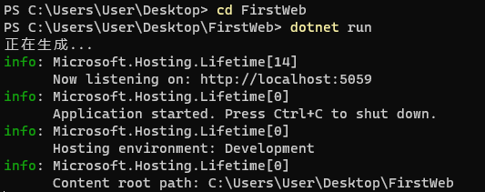

按住CTRL，点击终端中的“http://localhost:5059”打开浏览器。

浏览器显示“Hello World!”字符。

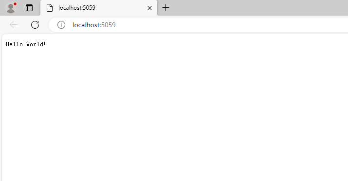

# 5 使用VS Code开发ASP.NET Core项目

将FirstWeb文件夹整个拖入VS Code的快捷方式。

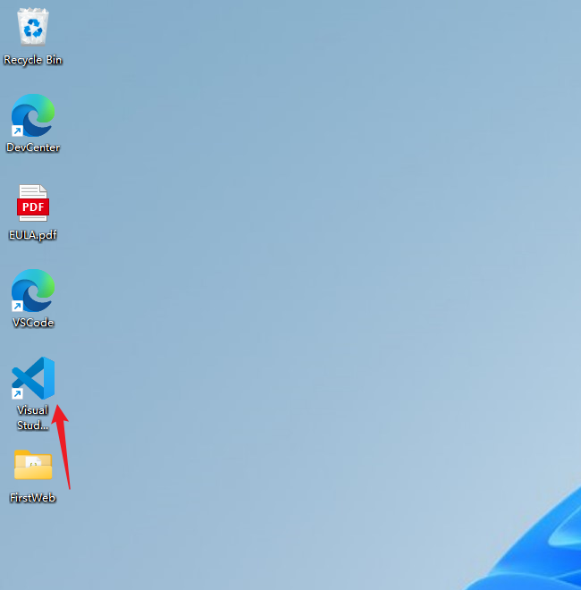

出现以下弹窗，选择“是，我信任此作者”。

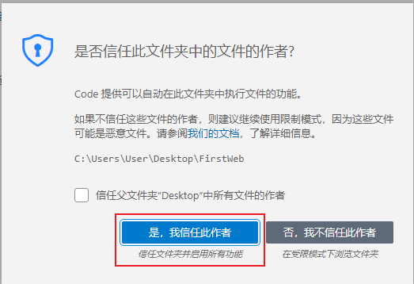

左边是资源管理器，可以创建文件和文件夹。右边是代码视图，可以编辑代码。

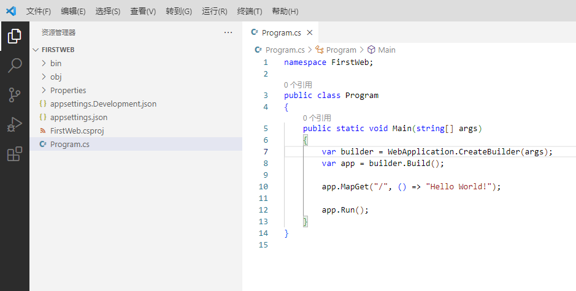