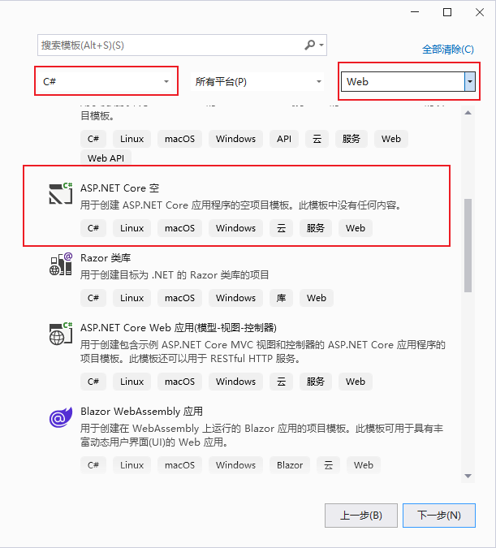

# 1 下载

打开浏览器，输入”https://visualstudio.microsoft.com/zh-hans/“后回车。

点击"Community 2022"下载安装文件“VisualStudioSetup.exe”。

# 2 安装

打开文件“VisualStudioSetup.exe”。

点击“继续”按钮。

等待安装程序下载。如果在此过程中下载速度始终为0，可以考虑关闭安装程序后将dns服务器设置为4.2.2.1或4.2.2.2在打开安装程序。

安装成功后的界面如下：

安装界面有很多模块可以选择安装。

在“工作负荷”菜单勾选“ASP.NET和Web开发”。

程序默认只会安装最新的“.NET8.0运行时”。

可以在“单个组件”菜单，勾选“.NET Core3.1运行时”、“.NET5.0运行时”、“.NET6.0运行时”、“.NET7.0运行时”。

教材中使用的是“.NET Core3.1运行时”，从安装界面可以看出，此版本已不受支持，也就是说已不再维护此版本，因此建议使用6.0以上的版本。但是从6.0版本开始，ASP.NET Core的项目结构有一些变化，从3.1版本创建的项目模板和6.0创建的项目模版是不同的，3.1版本的项目模版会多出一个StartUp.cs文件，而从6.0版本开始，这个文件就不再被创建。但是这个改变只会对中间件的添加方式以及服务的添加方式产生微小的影响，因此建议直接使用最新的8.0版本即可。

勾选完组件后直接点击安装即可。

此处显示勾选的“.NET Core3.1运行时”、“.NET5.0运行时”不再收到支持，点击继续。

等待下载与安装。

安装完成后会启动界面，第一次启动会要求登录账户，可以点击跳过。

选择一个喜欢的主题颜色然后启动程序。

# 3 创建项目

点击“创建新项目”。

编程语言选择“C#”，项目类型选择“Web”，然后选择“ASP.NET Core空”项目模版，点击“下一步”。

项目名称填写“FirstWeb”，位置可以选择其他文件夹。

将“配置HTTPS”勾选去掉，勾选“不使用顶级语句”，点击“创建”。

创建后的项目如上所示。

# 4 运行项目

点击浅绿色三角形按钮。这个时候可能弹出是否信任IIS证书，选择信任即可。

控制台界面启动，然后会自动弹出浏览器显示项目。

如果出现以上界面，说明项目启动成功。